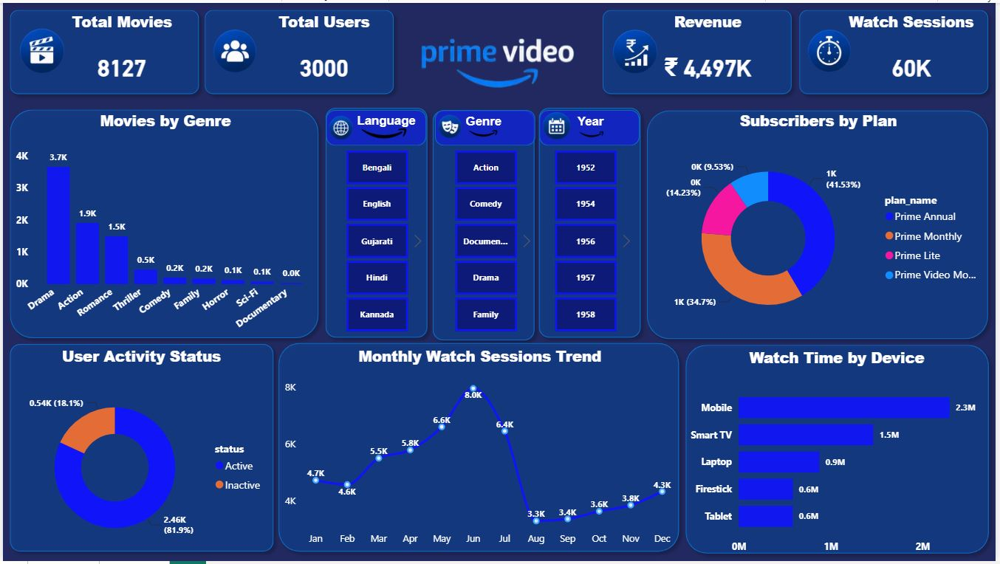

# 🎬 Prime Video Analytics Project

## 📌 Project Overview

This project is an end-to-end Prime Video Analytics solution built using **Python (Pandas)**, **SQL Server**, and **Power BI**. The project analyzes movie content, user activity, subscription plans, and watch history to generate business insights through an interactive dashboard.

---

## 🛠️ Tools Used

- Python (Pandas)
- SQL Server
- Power BI
- DAX

---

## 📂 Dataset

The project contains four tables:

- Movies
- Users
- Watch History
- Subscription Plans

---

## 📊 Dashboard Preview

---

## 🎯 Business Questions Answered

- Total Movies
- Total Users
- Revenue Analysis
- Watch Sessions
- Movies by Genre
- Subscribers by Plan
- User Activity Status
- Monthly Watch Trend
- Watch Time by Device
- Most Watched Movies
- Highest Rated Movies
- Top Active Users
- Language-wise Movie Distribution
- State-wise User Distribution
- Average IMDb Rating

---

## 🧠 SQL Concepts Used

- Joins
- Aggregate Functions
- GROUP BY
- HAVING
- Common Table Expressions (CTEs)
- Window Functions
- Ranking Functions
- CASE Statements
- Subqueries

---

## 📊 Power BI Features

- Data Modeling
- Relationships
- DAX Measures
- KPI Cards
- Interactive Slicers
- Donut Charts
- Bar Charts
- Line Chart
- Cross Filtering

---

## 🚀 Project Outcome

This project demonstrates practical skills in **Python (Pandas)** for data preparation, **SQL Server** for data analysis, and **Power BI** for interactive dashboard development, DAX measures, and business reporting.

---

## 👨‍💻 Author

**Manoj Varadi**
- GitHub: https://github.com/VaradiManoj
- LinkedIn: https://www.linkedin.com/in/manoj-varadi-184587326

---

## ⭐ If you found this project useful, consider giving it a Star.
